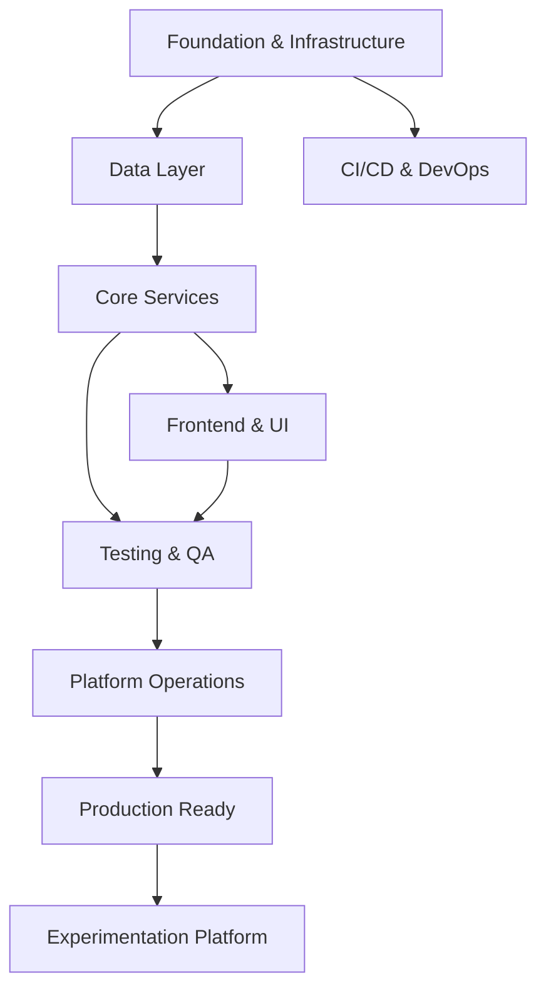

# KAIZEN Platform - Epics and Milestones Organization

## 🎯 Overview
- **Total Tasks**: 190 (T001-T190)
- **Completed**: 8 tasks (T001-T008)
- **Remaining**: 182 tasks
- **Approach**: Cloud Run serverless (not Kubernetes)

---

## 🏔️ EPIC STRUCTURE

### EPIC 1: Foundation & Infrastructure 🏗️
**Goal**: Establish core infrastructure and development environment
**Tasks**: 29 tasks
**Effort**: ~120 story points

#### Sub-Epics:
1. **Project Setup** (T001-T008) ✅ COMPLETED
2. **Cloud Run Infrastructure** (T183-T190) - NEW PRIORITY
3. **Containerization** (T009, T176)
4. **Shared Contracts** (T010, T010a)
5. **Terraform IaC** (T165, T167-T174)

---

### EPIC 2: Data Layer 💾
**Goal**: Database schema, migrations, and data models
**Tasks**: 26 tasks
**Effort**: ~90 story points

#### Sub-Epics:
1. **Database Migrations** (T011-T015)
2. **Rust Data Models** (T026-T031)
3. **Go Data Models** (T032-T034)
4. **Python Data Models** (T035-T036)

---

### EPIC 3: Core Services Implementation 🚀
**Goal**: Build the 7 microservices with business logic
**Tasks**: 30 tasks
**Effort**: ~250 story points

#### Sub-Epics:
1. **KRE Rule Engine** (T035-T037)
2. **GenUI Orchestrator** (T038-T042)
3. **User Context Service** (T043-T045)
4. **AI Sommelier** (T046-T048)
5. **PCM Classifier** (T049)
6. **Streaming Adapter** (T050)

---

### EPIC 4: Frontend & UI Components 🎨
**Goal**: Build adaptive UI with KDS component system
**Tasks**: 20 tasks
**Effort**: ~110 story points

#### Sub-Epics:
1. **KDS Atomic Components** (T051-T054)
2. **Template Components** (T055-T057)
3. **RMI Designer** (T063-T068)
4. **Admin & Analytics** (T081-T084)

---

### EPIC 5: Testing & Quality Assurance 🧪
**Goal**: Comprehensive testing at all levels
**Tasks**: 25 tasks
**Effort**: ~85 story points

#### Sub-Epics:
1. **Contract Tests (TDD)** (T016-T025)
2. **Integration Tests** (T058-T062)
3. **Performance Tests** (T025, T061)
4. **Security Testing** (T178)

---

### EPIC 6: CI/CD & DevOps 🔄
**Goal**: Automated build, test, and deployment pipelines
**Tasks**: 15 tasks
**Effort**: ~75 story points

#### Sub-Epics:
1. **GitHub Actions** (T175, T176)
2. **Cloud Build & Deployment** (T173, T188)
3. **GitOps & Progressive Delivery** (T179)
4. **Monitoring & Observability** (T071, T072, T080, T180, T189)
5. **Release Management** (T181, T182)

---

### EPIC 7: Platform Operations 🛡️
**Goal**: Production readiness and operational excellence
**Tasks**: 20 tasks
**Effort**: ~85 story points

#### Sub-Epics:
1. **Documentation** (T073-T075, T120, T121, T142)
2. **Security & Compliance** (T076, T078, T079)
3. **Cost Optimization** (T190)
4. **Ecosystem Features** (T085-T098)

---

### EPIC 8: Experimentation Platform 🧬
**Goal**: A/B testing and ML experimentation capabilities
**Tasks**: 44 tasks
**Effort**: ~220 story points

#### Sub-Epics:
1. **A/B Testing Platform** (T099-T122)
2. **Multi-Armed Bandits** (T123-T144)
3. **Advanced ML** (T145-T164)

---

## 📅 MILESTONE STRUCTURE

### 🏁 MILESTONE 1: MVP Foundation (Weeks 1-4)
**Goal**: Basic infrastructure and service scaffolding
**Target Date**: End of Week 4
**Epics**: Foundation & Infrastructure, Data Layer (partial)

#### Critical Path:
1. ✅ Project Setup (T001-T008) - DONE
2. Cloud Run Infrastructure (T183-T190)
3. Docker & CI/CD basics (T176, T175, T188)
4. Database setup (T011-T015, T167, T168)

#### Exit Criteria:
- [ ] All services deployable to Cloud Run
- [ ] Database migrations run successfully
- [ ] Basic CI/CD pipeline operational
- [ ] Development environment fully functional

---

### 🏁 MILESTONE 2: Core Platform (Weeks 5-10)
**Goal**: Functional adaptive UI generation
**Target Date**: End of Week 10
**Epics**: Core Services, Data Models

#### Critical Path:
1. Data Models (T026-T036)
2. Rule Engine (T035-T037)
3. GenUI Orchestrator (T038-T042)
4. Basic Frontend Components (T051-T054)

#### Exit Criteria:
- [ ] Rule engine evaluating conditions
- [ ] UI generation pipeline functional
- [ ] Basic KDS components rendered
- [ ] Service-to-service communication working

---

### 🏁 MILESTONE 3: User Experience (Weeks 11-14)
**Goal**: Complete frontend with adaptive features
**Target Date**: End of Week 14
**Epics**: Frontend & UI Components, Testing

#### Critical Path:
1. Template Components (T055-T057)
2. Integration Tests (T058-T062)
3. User Context & PCM (T043-T045, T049)
4. AI Sommelier basics (T046-T048)

#### Exit Criteria:
- [ ] Full UI adaptation based on PCM stages
- [ ] Content recommendations working
- [ ] End-to-end user journeys tested
- [ ] Performance targets met

---

### 🏁 MILESTONE 4: Production Ready (Weeks 15-18)
**Goal**: Production deployment with monitoring
**Target Date**: End of Week 18
**Epics**: CI/CD & DevOps, Platform Operations

#### Critical Path:
1. Monitoring & Observability (T180, T189)
2. Security hardening (T178)
3. Documentation (T073-T075)
4. Progressive delivery (T179)

#### Exit Criteria:
- [ ] Full monitoring dashboards live
- [ ] Security scans passing
- [ ] Documentation complete
- [ ] Load testing passed (10K users)

---

### 🏁 MILESTONE 5: Experimentation (Weeks 19-24)
**Goal**: A/B testing and ML optimization
**Target Date**: End of Week 24
**Epics**: Experimentation Platform

#### Critical Path:
1. A/B Testing core (T099-T110)
2. Experiment UI (T105, T107)
3. Basic MAB (T123-T130)

#### Exit Criteria:
- [ ] A/B tests can be configured and run
- [ ] Results dashboard functional
- [ ] Basic bandit algorithms working
- [ ] Integration with main platform

---

## 🎪 EPIC DEPENDENCIES

---

## 📊 EPIC SIZING

| Epic | Tasks | Story Points | Duration | Priority |
|------|-------|--------------|----------|----------|
| Foundation & Infrastructure | 29 | ~120 | 4 weeks | P0 |
| Data Layer | 26 | ~90 | 2 weeks | P0 |
| Core Services | 30 | ~250 | 6 weeks | P0 |
| Frontend & UI | 20 | ~110 | 3 weeks | P1 |
| Testing & QA | 25 | ~85 | Continuous | P1 |
| CI/CD & DevOps | 15 | ~75 | 2 weeks | P0 |
| Platform Operations | 20 | ~85 | 2 weeks | P1 |
| Experimentation | 44 | ~220 | 6 weeks | P2 |
| **TOTAL** | **190** | **~1035** | **~25 weeks** | - |

---

## 🚦 QUICK WINS (Can be done in parallel)

### Week 1-2 Quick Wins:
- T183: Cloud Run Terraform (5 pts)
- T176: Docker builds (8 pts)
- T175: GitHub Actions (8 pts)
- T011-T015: Database migrations (15 pts)

### Week 3-4 Quick Wins:
- T184-T187: Service migrations to Cloud Run (32 pts)
- T188: Cloud Run CI/CD (5 pts)
- T026-T031: Rust data models (30 pts)

---

## 🎯 RECOMMENDED EPIC PRIORITIES

### Priority 0 (Critical Path):
1. Cloud Run Infrastructure (T183-T190)
2. Data Layer (T011-T015, T026-T036)
3. Core Services - KRE & GenUI (T035-T042)
4. Basic CI/CD (T175, T176, T188)

### Priority 1 (Essential):
5. Frontend Components (T051-T057)
6. User Context & PCM (T043-T045, T049)
7. Testing (T016-T025, T058-T062)
8. Monitoring (T180, T189)

### Priority 2 (Enhanced):
9. AI Sommelier (T046-T048)
10. RMI Designer (T063-T068)
11. Documentation (T073-T075)
12. Security (T178)

### Priority 3 (Future):
13. Experimentation Platform (T099-T122)
14. Multi-Armed Bandits (T123-T144)
15. Advanced ML (T145-T164)

---

## 📋 EPIC TRACKING

Each epic should be tracked with:
- **Definition of Done**: Clear exit criteria
- **Key Metrics**: Performance, quality, completion
- **Dependencies**: Blocked by / Blocking
- **Risks**: Technical, resource, timeline
- **Progress**: Weekly burndown

---

## 🔄 AGILE CADENCE

### Recommended Sprint Structure:
- **Sprint Length**: 2 weeks
- **Epics per Sprint**: 1-2 major, 2-3 minor
- **Points per Sprint**: ~80-100
- **Team Size Assumption**: 3-4 developers

### Release Cadence:
- **MVP Release**: Week 4
- **Alpha Release**: Week 10
- **Beta Release**: Week 14
- **Production Release**: Week 18
- **Feature Releases**: Every 2 weeks after